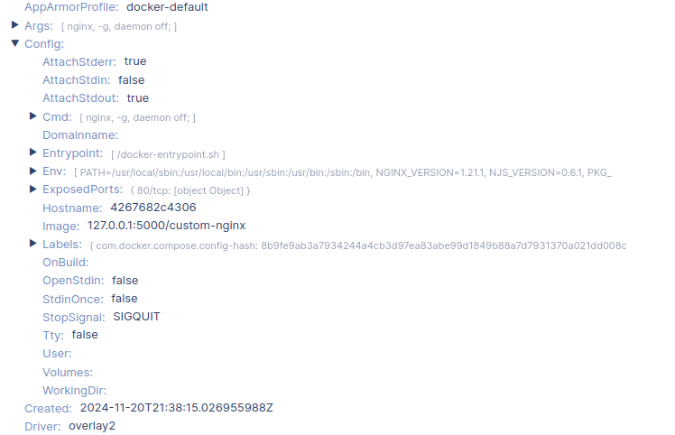
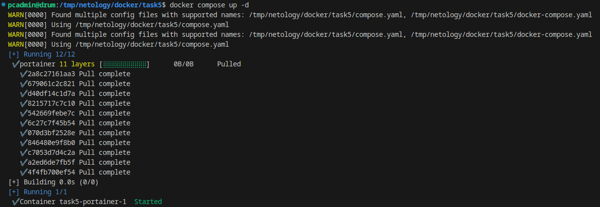
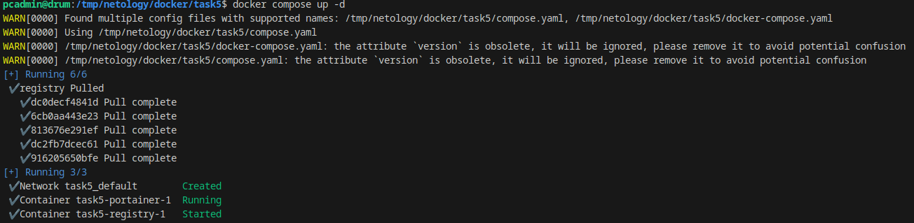
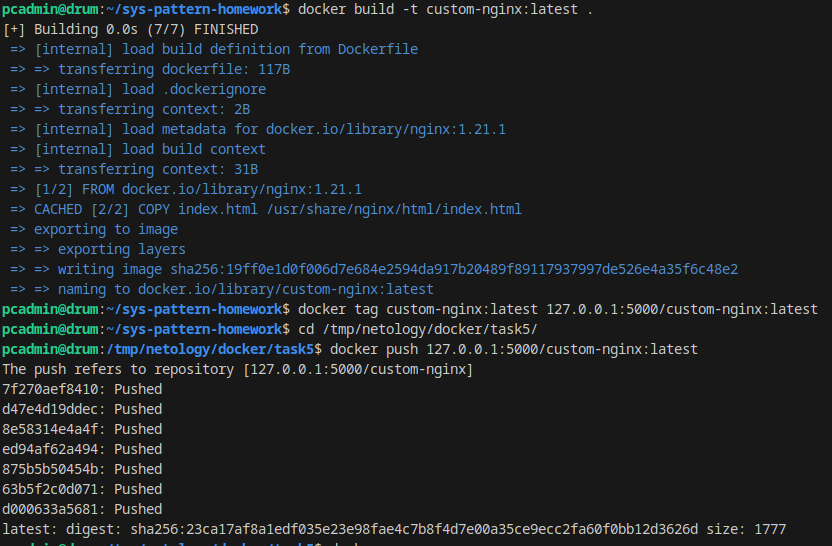
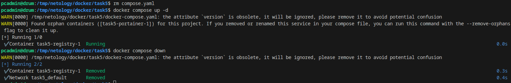

# Домашнее задание к занятию "`Название занятия`" - `Фамилия и имя студента`


### Инструкция по выполнению домашнего задания

   1. Сделайте `fork` данного репозитория к себе в Github и переименуйте его по названию или номеру занятия, например, https://github.com/имя-вашего-репозитория/git-hw или  https://github.com/имя-вашего-репозитория/7-1-ansible-hw).
   2. Выполните клонирование данного репозитория к себе на ПК с помощью команды `git clone`.
   3. Выполните домашнее задание и заполните у себя локально этот файл README.md:
      - впишите вверху название занятия и вашу фамилию и имя
      - в каждом задании добавьте решение в требуемом виде (текст/код/скриншоты/ссылка)
      - для корректного добавления скриншотов воспользуйтесь [инструкцией "Как вставить скриншот в шаблон с решением](https://github.com/netology-code/sys-pattern-homework/blob/main/screen-instruction.md)
      - при оформлении используйте возможности языка разметки md (коротко об этом можно посмотреть в [инструкции  по MarkDown](https://github.com/netology-code/sys-pattern-homework/blob/main/md-instruction.md))
   4. После завершения работы над домашним заданием сделайте коммит (`git commit -m "comment"`) и отправьте его на Github (`git push origin`);
   5. Для проверки домашнего задания преподавателем в личном кабинете прикрепите и отправьте ссылку на решение в виде md-файла в вашем Github.
   6. Любые вопросы по выполнению заданий спрашивайте в чате учебной группы и/или в разделе “Вопросы по заданию” в личном кабинете.
   
Желаем успехов в выполнении домашнего задания!
   
### Дополнительные материалы, которые могут быть полезны для выполнения задания

1. [Руководство по оформлению Markdown файлов](https://gist.github.com/Jekins/2bf2d0638163f1294637#Code)

---

### Задание 1

https://hub.docker.com/repository/docker/drumspb/custom-nginx/general

### Задание 2


### Задание 3

Отправлен сигнал SIGINT (Signal Interrupt) в операционных системах UNIX и UNIX-подобных системах, таких как Linux, используется для прерывания процесса. Данный сигнал генерируется, когда пользователь нажимает комбинацию клавиш Ctrl+C в терминале, что указывает системе, что пользователь хочет остановить запущенную программу.


После изменения порта Nginx с 80 на 81 контейнер будет не доступен на порту 8080, поскольку мы перенаправляем внутрь контейнера на 80 порт 80. Чтобы получить доступ к Nginx, нужно перенаправлять 8080 внутрь контейнера на 81.


### Задание 4




### Задание 5



Если существуют оба файла, Compose предпочитает канонический compose.yaml.

```
version: "3"
include:
  - docker-compose.yaml
services:
  portainer:
    network_mode: host
    image: portainer/portainer-ce:latest
    volumes:
      - /var/run/docker.sock:/var/run/docker.sock

```






после удаления compose.yaml получаем gредупреждение,которое  указывает, что Docker не может выполнить указанные в файле docker-compose.yaml параметры, он хочет, что-бы файл содержал корректную конфигурацию. Поскольку мы удалили compose.yaml, который был нужен для настройки Portainer, необходимо исправить это, сохранив соответствующие изменения.
