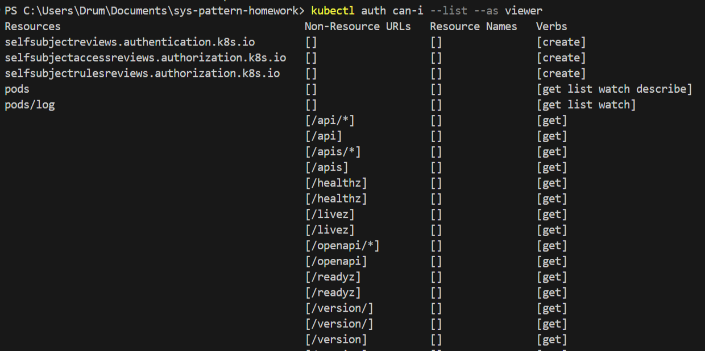

# Домашнее задание к занятию "`Управление доступом`" - `Дромашко Кирилл`

---

### Задание 1 Создайте конфигурацию для подключения пользователя

```shell
openssl genrsa -out viewer.key 2048

openssl req -new -key viewer.key -out viewer.csr -subj "/CN=viewer/O=viewers"

```

```yaml
apiVersion: certificates.k8s.io/v1
kind: CertificateSigningRequest
metadata:
  name: viewer-csr
spec:
  groups:
  - system:authenticated
  request: LS0tLS1CRUdJTiBDRVJUSUZJQ0FURSBSRVFVRVNULS0tLS0NCk1JSUNhRENDQVZBQ0FRQXdJekVQTUEwR0ExVUVBd3dHZG1sbGQyVnlNUkF3RGdZRFZRUUtEQWQyYVdWM1pYSnoNCk1JSUJJakFOQmdrcWhraUc5dzBCQVFFRkFBT0NBUThBTUlJQkNnS0NBUUVBekZYZ1k5c0R3NzdYdGVST25RQnkNCkRORmNwTXNvNzFUcGI5NkRLSE9ZYnRDNWkzSE5CcVlrRDRuOXQ0WVBmMG1kcmZLUzlZb0I5dkF1QTg0bGNGWDANCmNDY24xT2g0MUp6bTFURFZhZUdtSE8yZUhTQmxKVG9zYkxaU2RjaHFhUDNRR0x6N0RKeElCcmV4TzZUZXFmaEUNCjY0WEo3aXVZdlJ4RXJ6cS82VWZ2RFIxZk91QUROS093QW1WazZuREFCNS9EV0paTFhqSTdxdzUweVVvQUJhR3UNCkxhTUdUV1BLTENyRDlwbWg1SUttMTBpTjBuOWJjc08wMFc0ZWlFVUFPSHIwM3UwMGNFMTVXdDFVUlpoNnhuNU8NCkoxMGNUcUJyTm5IcjhpYXQrNXBQcERXV01BWHNicDhDSTQ5M1JLZXlSM1JaQ3RyYkgzSDFXcEp6MlJxQmp4UGENCmh3SURBUUFCb0FBd0RRWUpLb1pJaHZjTkFRRUxCUUFEZ2dFQkFEdWY1bzJCTXpLQVVuTHo5b1lOZkxTem9KMDMNCkMzTGVsampSYXVxUFdjekpTOEgvUHlXQVZpb1JSMjhmVjB2SGtDVFUzZWtHZ3AvYmtORlQvbFVlYW5BYzYvaE8NCkdHVjIyK290RmJLYkVhWVY3MHo5bXRYY3ppOTd5MHNmdmV1MmRZZS8xc1JVL1RGRWZ4SzRPclM1a1hxQWh1V2sNCms0UGFPTDBKcE0zaGtrSmN3NXZHejRmdDBqTjB6a1BZRU92eUhDTnpOcTRKYXljSmQxYnVvYnU0eXVqdGwyeksNCnljb25YVW9KTDhKZGFrcmJhSFRiWm82NXE4WVFTNHBSUWhBMmUvOGtUdnFHSUQ4Z3BSSHJ4cXJGZFQwOEtFSHUNCnpZYXo5dVVORGFaTCtsbEFoVVhwZFdZUkg2UUpwVmR5Y1JsbnQwVG9nWHEyZURVd2hTbEJFNnlHZFJJPQ0KLS0tLS1FTkQgQ0VSVElGSUNBVEUgUkVRVUVTVC0tLS0tDQo=
  signerName: kubernetes.io/kube-apiserver-client
  usages:
  - client auth
```

```power shell
kubectl apply -f csr.yaml

kubectl certificate approve viewer-csr

kubectl get csr viewer-csr -o jsonpath='{.status.certificate}' | % { [System.Text.Encoding]::UTF8.GetString([System.Convert]::FromBase64String($_)) } | Out-File -FilePath viewer.crt -Encoding ASCII

kubectl config set-cluster my-cluster --certificate-authority=ca.crt --server=https://192.168.88.151:6443 --kubeconfig=viewer-config

kubectl config set-credentials viewer --client-certificate=viewer.crt --client-key=viewer.key --kubeconfig=viewer-config

kubectl config set-context viewer-context --cluster=my-cluster --user=viewer --kubeconfig=viewer-config

kubectl config use-context viewer-context --kubeconfig=viewer-config
```

```yaml
apiVersion: rbac.authorization.k8s.io/v1
kind: Role
metadata:
  name: pod-viewer
  namespace: default
rules:
- apiGroups: [""]
  resources: ["pods", "pods/log"]
  verbs: ["get", "list", "watch"]
- apiGroups: [""]
  resources: ["pods"]
  verbs: ["describe"]

---

apiVersion: rbac.authorization.k8s.io/v1
kind: RoleBinding
metadata:
  name: viewer-pod-access
  namespace: default
subjects:
- kind: User
  name: viewer
  apiGroup: rbac.authorization.k8s.io
roleRef:
  kind: Role
  name: pod-viewer
  apiGroup: rbac.authorization.k8s.io
```



