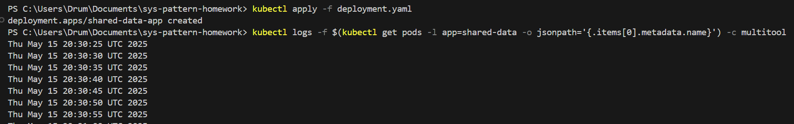
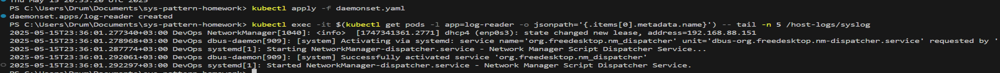

# Домашнее задание к занятию "`Хранение в K8s. Часть 1`" - `Дромашко Кирилл`


### Задание 1 Создать Deployment приложения, состоящего из двух контейнеров и обменивающихся данными.

```yaml
apiVersion: apps/v1
kind: Deployment
metadata:
  name: shared-data-app
spec:
  replicas: 1
  selector:
    matchLabels:
      app: shared-data
  template:
    metadata:
      labels:
        app: shared-data
    spec:
      containers:
      - name: busybox
        image: busybox
        command: ["/bin/sh", "-c"]
        args: ["while true; do echo $(date) >> /shared-data/log.txt; sleep 5; done"]
        volumeMounts:
        - name: shared-volume
          mountPath: /shared-data
      - name: multitool
        image: wbitt/network-multitool
        command: ["/bin/sh", "-c"]
        args: ["tail -f /shared-data/log.txt"]
        volumeMounts:
        - name: shared-volume
          mountPath: /shared-data
      volumes:
      - name: shared-volume
        emptyDir: {}
```



---

### Задание 2 Создать DaemonSet приложения, которое может прочитать логи ноды.

```yaml
apiVersion: apps/v1
kind: DaemonSet
metadata:
  name: log-reader
spec:
  selector:
    matchLabels:
      app: log-reader
  template:
    metadata:
      labels:
        app: log-reader
    spec:
      containers:
      - name: multitool
        image: wbitt/network-multitool
        command: ["/bin/sh", "-c"]
        args: ["tail -f /host-logs/syslog"]
        volumeMounts:
        - name: host-logs
          mountPath: /host-logs
          readOnly: true
      volumes:
      - name: host-logs
        hostPath:
          path: /var/log
          type: Directory
```

