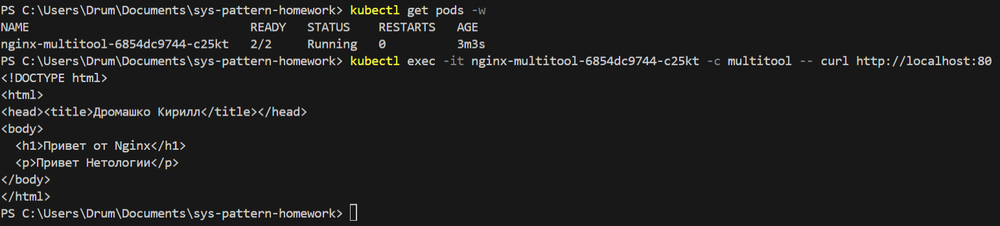
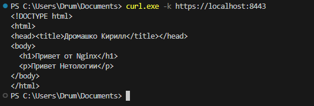

# Домашнее задание к занятию "Конфигурация приложений" - `Дромашко Кирилл`

---

### Задание 1 Создать Deployment приложения и решить возникшую проблему с помощью ConfigMap. Добавить веб-страницу

```yaml
apiVersion: v1
kind: ConfigMap
metadata:
  name: web-content
data:
  index.html: |
    <!DOCTYPE html>
    <html>
    <head><title>Дромашко Кирилл</title></head>
    <body>
      <h1>Привет от Nginx</h1>
      <p>Привет Нетологии</p>
    </body>
    </html>
  default.conf: |  
    server {
        listen 80;
        server_name _;
        root /usr/share/nginx/html;
        index index.html;
        
        location / {
            try_files $uri $uri/ =404;
        }
        
        location /multitool {
            proxy_pass http://localhost:8080;
        }
    }

---

apiVersion: apps/v1
kind: Deployment
metadata:
  name: nginx-multitool
spec:
  replicas: 1
  selector:
    matchLabels:
      app: web-app
  template:
    metadata:
      labels:
        app: web-app
    spec:
      containers:
      - name: nginx
        image: nginx:1.25.3
        ports:
        - containerPort: 80
        volumeMounts:
        - name: web-content
          mountPath: /usr/share/nginx/html/
        - name: nginx-config
          mountPath: /etc/nginx/conf.d/default.conf
          subPath: default.conf
      - name: multitool
        image: wbitt/network-multitool
        env:
          - name: HTTP_PORT
            value: "8080"
        ports:
        - containerPort: 8080
      volumes:
      - name: web-content
        configMap:
          name: web-content
          items:
          - key: index.html
            path: index.html
      - name: nginx-config
        configMap:
          name: web-content
          items:
          - key: default.conf
            path: default.conf

---

apiVersion: v1
kind: Service
metadata:
  name: web-service
spec:
  selector:
    app: web-app
  ports:
    - name: http
      port: 80
      targetPort: 80
    - name: multitool
      port: 8080
      targetPort: 8080
```



---

### Задание 2 Создать приложение с вашей веб-страницей, доступной по HTTPS

```yaml
apiVersion: v1
kind: ConfigMap
metadata:
  name: secure-web-content
data:
  index.html: |
    <!DOCTYPE html>
    <html>
    <head>
        <title>Безопасная страница</title>
        <style>
            body { font-family: Arial, sans-serif; margin: 40px; }
            h1 { color: #2c3e50; }
            .secure { color: #27ae60; font-weight: bold; }
        </style>
    </head>
    <body>
        <h1>Добро пожаловать на <span class="secure">безопасный</span> сайт!</h1>
        <p>Это страница с HTTPS подключением</p>
    </body>
    </html>
  default.conf: |
    server {
        listen 443 ssl;
        server_name mysecureapp.example.com;
        
        ssl_certificate /etc/nginx/certs/tls.crt;
        ssl_certificate_key /etc/nginx/certs/tls.key;
        
        root /usr/share/nginx/html;
        index index.html;
        
        location / {
            try_files $uri $uri/ =404;
        }
    }

---

apiVersion: apps/v1
kind: Deployment
metadata:
  name: secure-app
spec:
  replicas: 1
  selector:
    matchLabels:
      app: secure-app
  template:
    metadata:
      labels:
        app: secure-app
    spec:
      containers:
      - name: nginx
        image: nginx
        ports:
        - containerPort: 443
        volumeMounts:
        - name: web-content
          mountPath: /usr/share/nginx/html
        - name: nginx-config
          mountPath: /etc/nginx/conf.d/default.conf
          subPath: default.conf
        - name: certs
          mountPath: /etc/nginx/certs
          readOnly: true
      volumes:
      - name: web-content
        configMap:
          name: secure-web-content
          items:
          - key: index.html
            path: index.html
      - name: nginx-config
        configMap:
          name: secure-web-content
          items:
          - key: default.conf
            path: default.conf
      - name: certs
        secret:
          secretName: ssl-certificate

---

apiVersion: v1
kind: Service
metadata:
  name: secure-service
spec:
  selector:
    app: secure-app
  ports:
    - protocol: TCP
      port: 443
      targetPort: 443

---

apiVersion: networking.k8s.io/v1
kind: Ingress
metadata:
  name: secure-ingress
  annotations:
    nginx.ingress.kubernetes.io/backend-protocol: "HTTPS"
spec:
  tls:
  - hosts:
    - mysecureapp.example.com
    secretName: ssl-certificate
  rules:
  - host: mysecureapp.example.com
    http:
      paths:
      - path: /
        pathType: Prefix
        backend:
          service:
            name: secure-service
            port:
              number: 443
```

```PowerShell
openssl req -x509 -nodes -days 365 -newkey rsa:2048 -keyout tls.key -out tls.crt -subj "/CN=mysecureapp.example.com/O=My Organization"

kubectl create secret tls ssl-certificate --key tls.key --cert tls.crt

kubectl port-forward service/secure-service 8443:443

curl.exe -k https://localhost:8443
```



---
