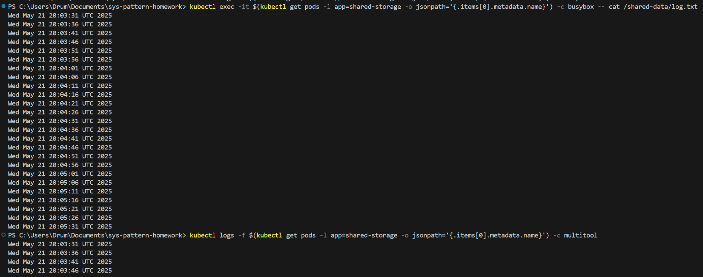
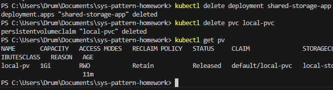
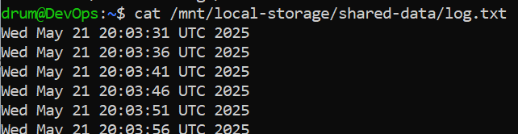
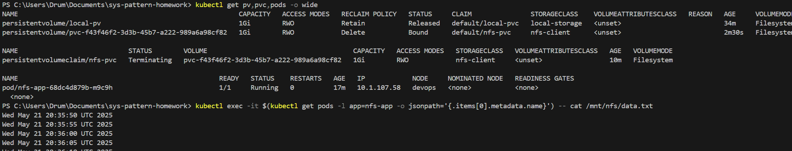

# Домашнее задание к занятию "`Хранение в K8s. Часть 2`" - `Дромашко Кирилл`

---

### Задание 1 Создать Deployment приложения, использующего локальный PV, созданный вручную.

```yaml
apiVersion: v1
kind: PersistentVolume
metadata:
  name: local-pv
spec:
  capacity:
    storage: 1Gi
  volumeMode: Filesystem
  accessModes:
  - ReadWriteOnce
  persistentVolumeReclaimPolicy: Retain
  storageClassName: local-storage
  local:
    path: /mnt/local-storage/shared-data
  nodeAffinity:
    required:
      nodeSelectorTerms:
      - matchExpressions:
        - key: kubernetes.io/hostname
          operator: In
          values:
          - devops

---

apiVersion: v1
kind: PersistentVolumeClaim
metadata:
  name: local-pvc
spec:
  accessModes:
  - ReadWriteOnce
  storageClassName: local-storage
  resources:
    requests:
      storage: 1Gi

--- 

apiVersion: apps/v1
kind: Deployment
metadata:
  name: shared-storage-app
spec:
  replicas: 1
  selector:
    matchLabels:
      app: shared-storage
  template:
    metadata:
      labels:
        app: shared-storage
    spec:
      containers:
      - name: busybox
        image: busybox
        command: ["/bin/sh", "-c"]
        args: ["while true; do echo $(date) >> /shared-data/log.txt; sleep 5; done"]
        volumeMounts:
        - name: shared-storage
          mountPath: /shared-data
      - name: multitool
        image: wbitt/network-multitool
        command: ["/bin/sh", "-c"]
        args: ["tail -f /shared-data/log.txt"]
        volumeMounts:
        - name: shared-storage
          mountPath: /shared-data
      volumes:
      - name: shared-storage
        persistentVolumeClaim:
          claimName: local-pvc

```



```
kubectl delete deployment shared-storage-app
kubectl delete pvc local-pvc
```
Политика Retain сохраняет PV и данные после удаления PVC. PV переходит в статус Released и может быть вручную очищен для повторного использования.



Все данные на ноде сохраняются так как PV использует локальное хранилище (hostPath)
Политика хранения Retain предотвращает автоматическое удаление




---

### Задание 2 Создать Deployment приложения, которое может хранить файлы на NFS с динамическим созданием PV.

```bash
microk8s helm3 upgrade nfs-subdir-external-provisioner \
    nfs-subdir-external-provisioner/nfs-subdir-external-provisioner \
    --set nfs.server=192.168.88.151 \
    --set nfs.path=/shared \
    --set storageClass.defaultClass=true
```

```yaml
apiVersion: apps/v1
kind: Deployment
metadata:
  name: nfs-app
spec:
  replicas: 1
  selector:
    matchLabels:
      app: nfs-app
  template:
    metadata:
      labels:
        app: nfs-app
    spec:
      containers:
      - name: multitool
        image: wbitt/network-multitool
        command: ["/bin/sh", "-c"]
        args: ["while true; do echo $(date) >> /mnt/nfs/data.txt; sleep 5; done"]
        volumeMounts:
        - name: nfs-volume
          mountPath: /mnt/nfs
      volumes:
      - name: nfs-volume
        persistentVolumeClaim:
          claimName: nfs-pvc

---

apiVersion: v1
kind: PersistentVolumeClaim
metadata:
  name: nfs-pvc
spec:
  accessModes:
  - ReadWriteOnce
  resources:
    requests:
      storage: 1Gi
  storageClassName: nfs-client 
```



---