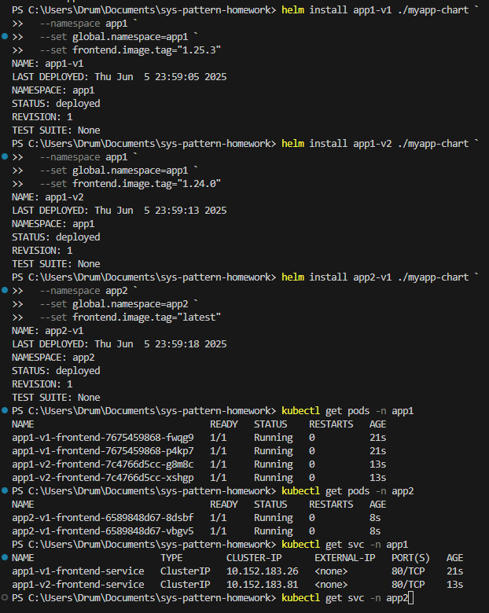

# Домашнее задание к занятию "`Helm`" - `Дромашко Кирилл`


### Задание 1 Подготовить Helm-чарт для приложения

Chart.yaml

```
apiVersion: v2
name: myapp-chart
description: A Helm chart for my application
version: 0.1.0
appVersion: 1.0.0
```
values.yaml

```
global:
  namespace: default

frontend:
  replicaCount: 2
  image:
    repository: nginx
    tag: "1.25.3"  # Используем конкретную стабильную версию
    pullPolicy: IfNotPresent
  service:
    type: ClusterIP
    port: 80
    targetPort: 80
```

templates/frontend/deployment.yaml

```
apiVersion: apps/v1
kind: Deployment
metadata:
  name: {{ .Release.Name }}-frontend
  namespace: {{ .Values.global.namespace }}
  labels:
    app: {{ .Release.Name }}-frontend
spec:
  replicas: {{ .Values.frontend.replicaCount }}
  selector:
    matchLabels:
      app: {{ .Release.Name }}-frontend
  template:
    metadata:
      labels:
        app: {{ .Release.Name }}-frontend
    spec:
      containers:
      - name: nginx
        image: "{{ .Values.frontend.image.repository }}:{{ .Values.frontend.image.tag }}"
        imagePullPolicy: {{ .Values.frontend.image.pullPolicy }}
        ports:
        - containerPort: 80
```

templates/frontend/service.yaml

```
apiVersion: v1
kind: Service
metadata:
  name: {{ .Release.Name }}-frontend-service
  namespace: {{ .Values.global.namespace }}
spec:
  type: {{ .Values.frontend.service.type }}
  ports:
  - port: {{ .Values.frontend.service.port }}
    targetPort: {{ .Values.frontend.service.targetPort }}
  selector:
    app: {{ .Release.Name }}-frontend
```
---

### Задание 2 Запустить две версии в разных неймспейсах


