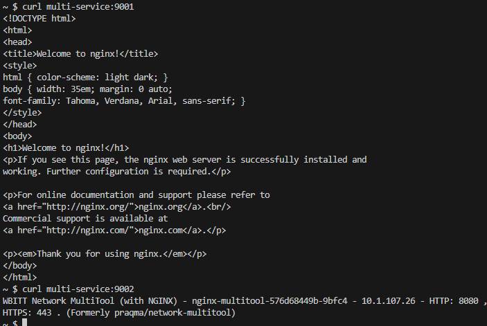
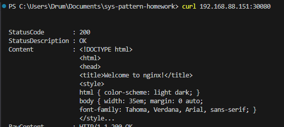

# Домашнее задание к занятию "Сетевое взаимодействие в K8S. Часть 1" - `Дромашко Кирилл`

### Задание 1 Создать Deployment и обеспечить доступ к контейнерам приложения по разным портам из другого Pod внутри кластера

```yaml
apiVersion: apps/v1
kind: Deployment
metadata:
  name: nginx-multitool
spec:
  replicas: 3
  selector:
    matchLabels:
      app: multi-container
  template:
    metadata:
      labels:
        app: multi-container
    spec:
      containers:
      - name: nginx
        image: nginx:1.25.3
        ports:
        - containerPort: 80
      - name: multitool
        image: wbitt/network-multitool
        env:
          - name: HTTP_PORT
            value: "8080"
        ports:
        - containerPort: 8080
```

```yaml
apiVersion: v1
kind: Service
metadata:
  name: multi-service
spec:
  selector:
    app: multi-container
  ports:
  - name: nginx-port
    port: 9001
    targetPort: 80
  - name: multitool-port
    port: 9002
    targetPort: 8080
```



### Задание 2 Создать Service и обеспечить доступ к приложениям снаружи кластера

```yaml
apiVersion: v1
kind: Service
metadata:
  name: nginx-nodeport
spec:
  type: NodePort
  selector:
    app: multi-container
  ports:
  - port: 80
    targetPort: 80
    nodePort: 30080

```


